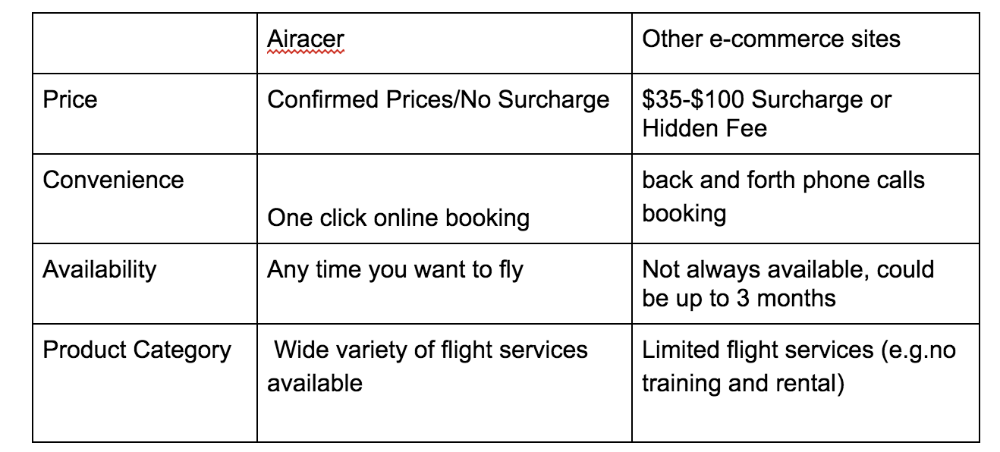
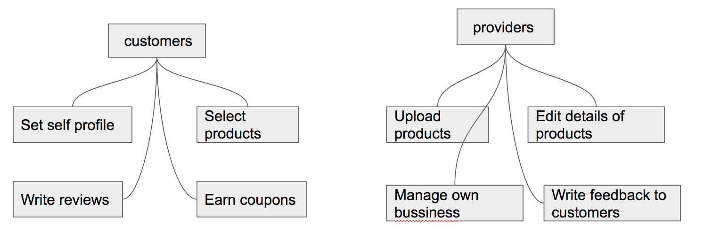
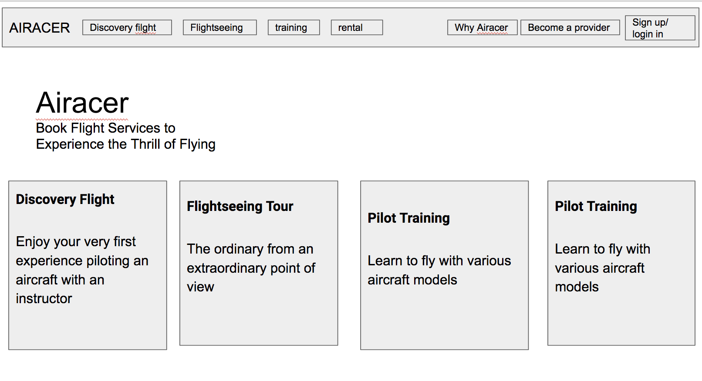
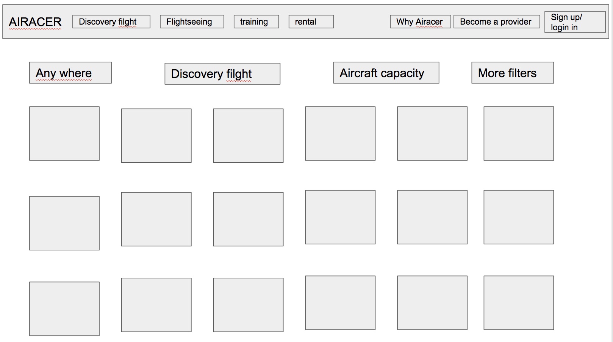
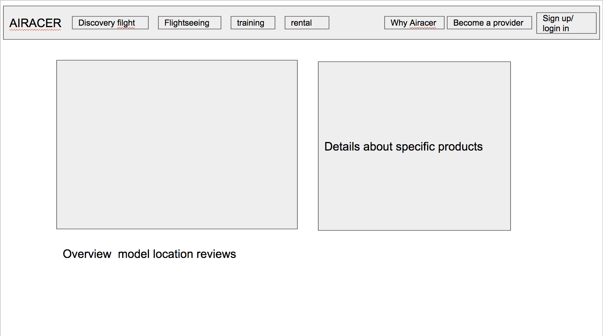
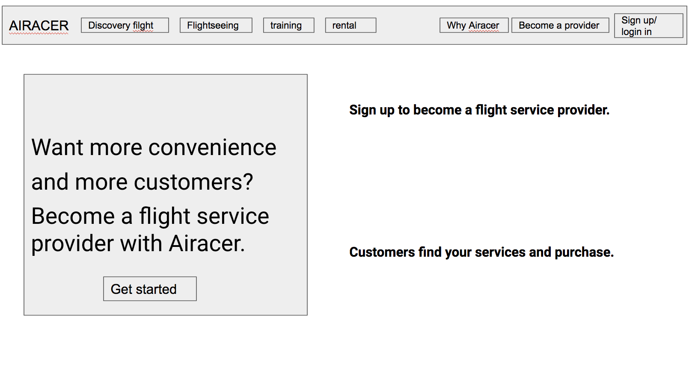

# MSTU 5013 Airacer Design Document

## Topic
I want to create an online marketplace in the General Aviation industry. It is the one-stop shopping site for your overall aviation experience. By seamlessly connecting flight service providers to future pilots, flight enthusiasts and AvGeeks, I want to make flying more accessible. I dedicated to providing a platform where aviation enthusiasts can share their passion with like-minded people. And also the website can help students study fly knowledge online.

## Problem
The current aviation market, there are a variety of large and small different business models, some of which small flight school, not only the flight quality is difficult to guarantee, while the price is also uneven, often cause consumer confusion. After experiencing the flight study, I think that there is an objective and fair platform to integrate all the flight experience activities and publish it on the website, which will make the aviation market more open and transparent. This helps to remove some fake information. Users can write some reviews on flight experience which they participate. New users through the fair rating and evaluation to objectively judge and select the flight products.
At the same time, the system also helped flight schools and individual pilots to provide their business model. They can like Uber drivers, to have their own business. This will help them to use their leisure time, earn more money, but also can reduce the average cost of the entire industry, to bring convenience to customers.

## Target Audience
* customers:
If you are a future pilot, flight enthusiast or flight lover, you can enjoy a variety of flight services from introductory flights, to sightseeing flights, to flight training to aircraft rental. We deal with all aircraft types including airplanes, helicopters, gliders, para-gliders, hot air balloons, drones and more!

* service providers
Whether you run a flight school or are a free-lance certified flight instructor or a commercial pilot, Airacer provides you with a complete management system for your business and your schedule. It even helps you to track aviation weather. More importantly, the Airacer system exposes you and your business to the enormous number of customers waiting to be served by you.

### User Stories
- **User Story 1:**
Casey is a Columbia student. She has bought the 90 minutes experience from academy aviation school in Long Island city. First she thought that would be a bit too long, but she tells  others that time flew away so it was really worth it. she practiced approach and landing at six different airports (you can choose which ever you want, but also listen to the pilots recommendations, since they know which one are more challenging). Although she was only a 22-year-old girl, but through the flight experience several times. Casey said he wanted to be a pilot and enrolled a three-month flight training course by Airacer platform.

- **User Story 2:**
Tao is an engineer work for Google. He based on San Francisco. A couple of months back Tao’s wife had surprised him on his birthday with a 60 minute flight experience. She knew Tao was always interested in flying but never got around to getting flying lessons so she came across Airacer and bought a voucher online. It was Great!

- **User Story 3:**
Darren is a retired teacher living in Florida, and he is 55 years old. Although Darren has retired, but he is very healthy, he still hopes to do something that he really good at and  also can use his own leisure work. Since he used to have a commercial pilot's driver's license, he decided to try when he heard that airacer could help him have his own business, as easy as making money like a Uber driver. Upload his services at any time to expose to the Airacer client. He can make money easily in his spare time. Now he has eight students as an individual instructor.

## Strategy
To Service Providers:
* Airacer provides you with a sophisticated management system, and illuminates your brand and your school to potential flight enthusiasts.
* Airacer’s management system makes sure that you have the best user-friendly experience.
* Airacer’s system fully encrypts your data.
* Airacer charges no fee for the initial management system

To Customers                                          

### Site Objectives:
Our goal is to effectively integrate Airbnb and Uber. Make a website like airbnb or Uber in the sky.

### Success Metrics
I hope to have more and more customers choose to use my website, and there are more pilots as a product provider oin the system, so good financial transaction, to ensure the normal operation of the company.

## Scope
Different countries have different air policies and restrictions on airspace. So I hope to use three years increase the US market share to 50%, and then do the global expansion. Similar to Europe and then into Asia, China and other countries. The first three years we mainly provide US products, but our consumers can be from all around the world. People who just interested in flying. They may tourists or enthusiasts who want to be pilots.

## Structure
The American examination system is constantly updated, the method of examination, the difficulty of the title, etc., need accurate teaching research and timely information. We are committed to providing the latest news and teaching results show and share it to the registered users.

## Skeleton
In the navigation bar, i will provide a detailed description of the website, filghts type introduction,, and set aside interactive platform to organize online or offline activities. Provide user registration, consultation and payment services. 

